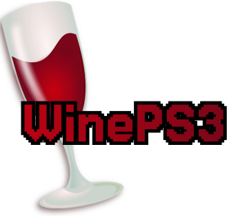

 Полный порт Wine для PlayStation 3

 — это адаптация Wine для PlayStation 3, позволяющая запускать приложения и игры, написанные для Windows, на консоли PS3. Проект включает поддержку графических приложений через интеграцию с библиотеками PSL1GHT и оптимизацию под архитектуру Cell Broadband Engine.

---

## Особенности
- Запуск Windows-приложений (32-битные .exe) на PlayStation 3.
- Графическая поддержка через трансляцию DirectX в OpenGL ES.
- Интеграция с PSL1GHT SDK для работы с системными ресурсами PS3.
- Оптимизация под многопоточную архитектуру Cell BE.
- Поддержка базовых компонентов Wine (DLL-библиотеки, реестр, файловая система).

---

## Требования
- PlayStation 3 с прошивкой **4.84+** (рекомендуется Custom Firmware, например, **Ferrox** или **Rebug**).
- Установленный **PSL1GHT SDK** и инструменты компиляции (devkitPPC, make, git).
- Минимум **2 ГБ свободного места** на HDD/USB-накопителе.
- Подключение к интернету для загрузки зависимостей.

---

